# WeatherWatch  

WeatherWatch is an iOS application that provides real-time weather updates, detailed hourly and daily forecasts, and weather condition tracking for multiple cities. The app automatically determines the user's location and also allows manual city searches.  
Weather data is fetched from [OpenWeather API](https://api.openweathermap.org/). The app features unit customization (Celsius/Fahrenheit, wind speed, pressure), light and dark themes, and optimized data caching for an efficient and seamless experience.  
Built with MVVM architecture, WeatherWatch ensures a scalable, modular, and maintainable codebase. The app supports localization in English and Russian.  
Weather Watch includes four separate implementations with identical functionality. The first two versions utilize URLSession and Alamofire with Grand Central Dispatch (GCD), while the latest versions leverage Structured Concurrency (async/await) with URLSession and Alamofire. This allows for a comprehensive comparison of different networking and concurrency approaches.

## Stack  

- **iOS Version:** 17.2+  
- **Technologies:** Swift, UIKit, Auto Layout, UITableView, UICollectionView, UINavigationController, CoreLocation, NSCache  
- **Database:** Realm (installed via Swift Package Manager, supports automatic schema migrations) 
- **Data Persistence:** UserDefaults (stores the last selected city, user preferences such as measurement units and theme selection)
- **UI:** Fully implemented in code (programmatic UI)  
- **Architecture:** MVVM with a modular, scalable structure
- **Localization:** Localizable.strings for English and Russian

## Features  

- Retrieves weather data from [OpenWeather API](https://api.openweathermap.org/) and loads it into the app.  
- Provides real-time weather updates for multiple cities, including temperature, "feels like" temperature, humidity, wind speed, pressure, sunrise, and sunset times. 
- Displays the correct local time for each city based on its timezone offset
- Allows users to search, add, reorder, and delete cities from their list.  
- Caches city data for smooth navigation and quick access.  
- Remembers and restores the last opened city upon app relaunch.  
- Uses CoreLocation to fetch weather updates for the user's current location.  
- A persistent current location city is always present and updates dynamically when the user moves beyond a specified distance. The updated location coordinates are used when fetching new weather data.  
- Automatically updates weather when reopening the app or returning from the background.  
- Pull-to-refresh gesture allows users to manually update weather data.  
- Securely stores the API key in Config.xcconfig, which is injected into Info.plist to prevent exposure in the codebase.  
- Supports multiple database migrations to ensure smooth updates without data loss.  
- Introduces a background update module that fills in missing city coordinates and other fields after database migration. This process runs in the background without blocking the user interface, allowing the app to function normally while the migration completes.  
- Dynamically loads weather icons from the server and caches them using NSCache to improve performance.  
- Supports Light and Dark mode, with the selected theme applied globally.  
- Allows users to customize measurement units:  
  - Temperature: °C / °F  
  - Wind speed: m/s, km/h, mph, knots  
  - Pressure: hPa, mmHg, mbar, inHg  
- Uses UserDefaults to ensure all settings persist across app relaunches.  
- The reuseIdentifier for table view and collection view cells is automatically generated based on the class name, simplifying the registration and reuse process.  
- Uses optimized DateFormatter caching for efficient date and time formatting, reducing computational overhead and improving performance.   
- Centralizes color themes, font styles, layout dimensions, and API configurations in a structured Constants file, ensuring consistency across the app.  
- Supports localization in English and Russian.  

### Version: WeatherWatch1  
[Link to folder](https://github.com/evgenff1/WeatherWatch/tree/main/WeatherWatch1)

- **Networking Specific to This Version:** API requests via **URLSession** with structured **URLComponents**, error handling via **NetworkError**, network monitoring via **NWPathMonitor**  
- **Concurrency Specific to This Version:** Grand Central Dispatch (GCD) for background tasks and async operations

## Features (Specific Advantages) 

- Fetches and parses weather data via URLSession, utilizing URLComponents for structured request formation. 
- Implements custom NetworkError handling for scenarios such as no internet, API errors, unauthorized access, timeouts, and service unavailability. A message is displayed when there is no internet connection.  
- Uses NetworkMonitor (NWPathMonitor) to detect internet availability and update the UI accordingly.  
- Implements Grand Central Dispatch (GCD) for asynchronous data fetching, caching, and UI updates, improving app responsiveness and performance. 

---

### Version: WeatherWatch2
[Link to folder](https://github.com/evgenff1/WeatherWatch/tree/main/WeatherWatch2)
 
- **Networking Specific to This Version:** API requests via **Alamofire** (installed via Swift Package Manager), with structured **URLComponents**, error handling via **AFError**, network monitoring via **NetworkReachabilityManager**   
- **Concurrency Specific to This Version:** Grand Central Dispatch (GCD) for background tasks and async operations

## Features (Specific Advantages) 

- Fetches and parses weather data via Alamofire, utilizing URLComponents for structured request formation, benefiting from built-in request validation and response serialization.   
- Implements error handling using AFError from Alamofire, simplifying error categorization and improving reliability in handling network failures such as timeouts, unauthorized access, and service unavailability.  
- Uses NetworkReachabilityManager from Alamofire to monitor network connectivity and update the UI accordingly.  
- Leverages Alamofire's built-in request validation, eliminating the need for manual HTTP status code checks.  
- Simplifies JSON decoding with responseDecodable, reducing boilerplate code.  
- Implements Grand Central Dispatch (GCD) for asynchronous data fetching, caching, and UI updates, improving app responsiveness and performance. 

---

### 📌 Version: WeatherWatch3  
[Link to folder](https://github.com/evgenff1/WeatherWatch/tree/main/WeatherWatch3)  

- **Networking Specific to This Version:** API requests via **URLSession** with structured **URLComponents**, error handling via **NetworkError**, network monitoring via **NWPathMonitor**, now implemented with async/await for improved readability and efficiency.  
- **Concurrency Specific to This Version:** Structured Concurrency (async/await) for background tasks and async operations. 

## Features (Specific Advantages)  

- Inherits all URLSession-related features from WeatherWatch1.
- Leverages Swift's async/await to simplify asynchronous function calls, resulting in linear, readable code that is easier to debug and maintain.
- Async/await in URLSession ensures that networking tasks are executed in a non-blocking manner and integrate seamlessly with Structured Concurrency.
- Improved error handling via try/catch removes the need for nested completion handlers and manual DispatchQueue management.
- Provides a modern, scalable solution for networking tasks, offering performance improvements and enhanced code clarity.

---

### 📌 Version: WeatherWatch4  
[Link to folder](https://github.com/evgenff1/WeatherWatch/tree/main/WeatherWatch4)  

- **Networking Specific to This Version:** API requests via **Alamofire** (installed via Swift Package Manager), with structured **URLComponents**, error handling via **AFError**, network monitoring via **NetworkReachabilityManager**, now implemented with async/await to enhance performance and simplify API calls.  
- **Concurrency Specific to This Version:** Structured Concurrency (async/await) for background tasks and async operations.  

## Features (Specific Advantages)  

- Inherits all Alamofire-related features from WeatherWatch2.
- Leverages async/await in functions to significantly simplify asynchronous code, eliminating deep nesting and reducing boilerplate associated with completion handlers.
- Async/await in Alamofire allows for concise request validation, response serialization, and error handling, making the networking layer more robust and easier to debug.
- Enhances code readability and maintainability by providing a linear execution flow with try/catch for error management.
- Integrates seamlessly with Structured Concurrency, ensuring non-blocking execution and improved performance for network operations.

---

## Screenshots  

<table align="center">
  <tr>
    <td>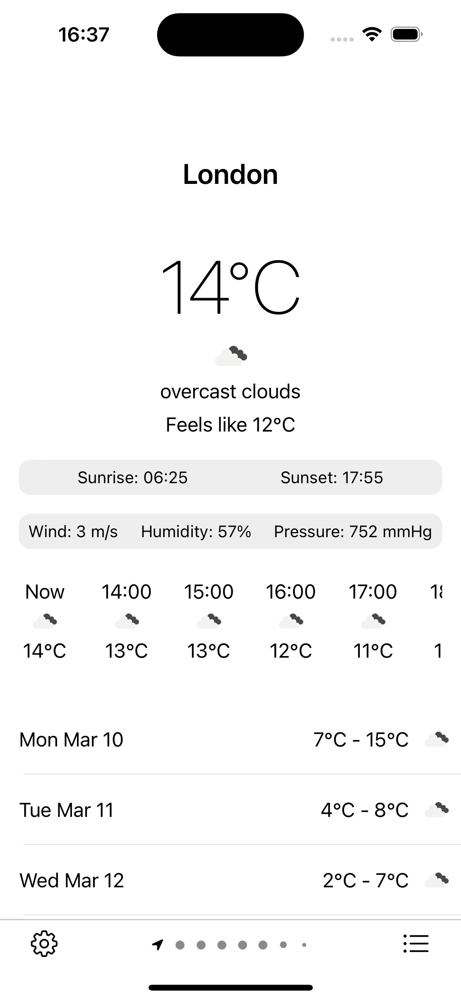</td>
    <td>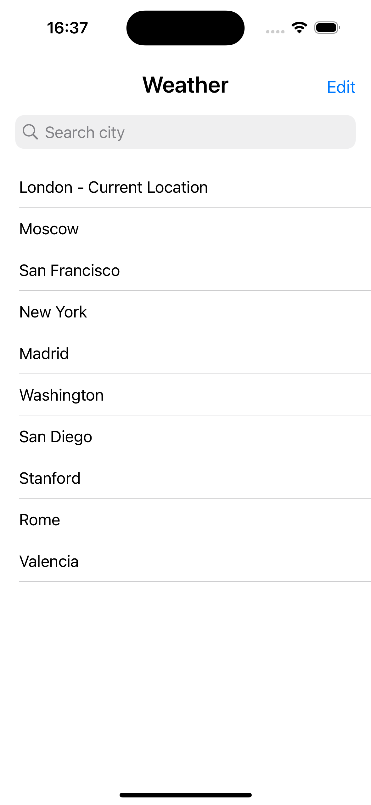</td>
    <td>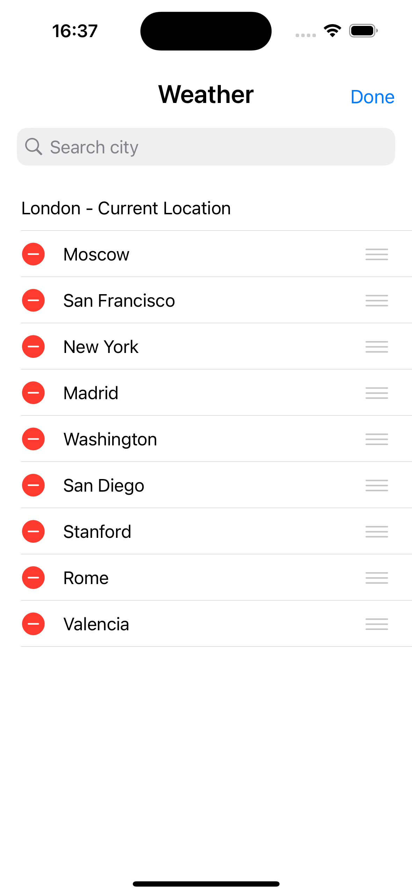</td>
  </tr>
  <tr>
    <td>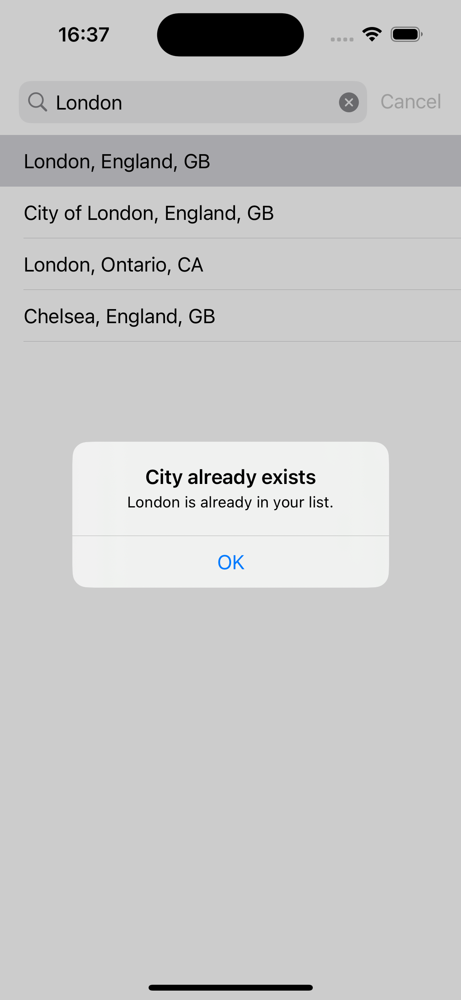</td>
    <td>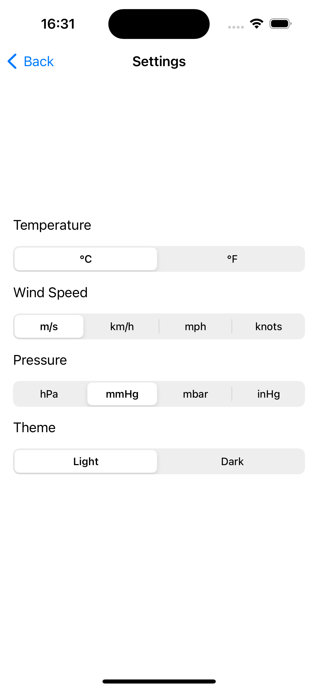</td>
    <td>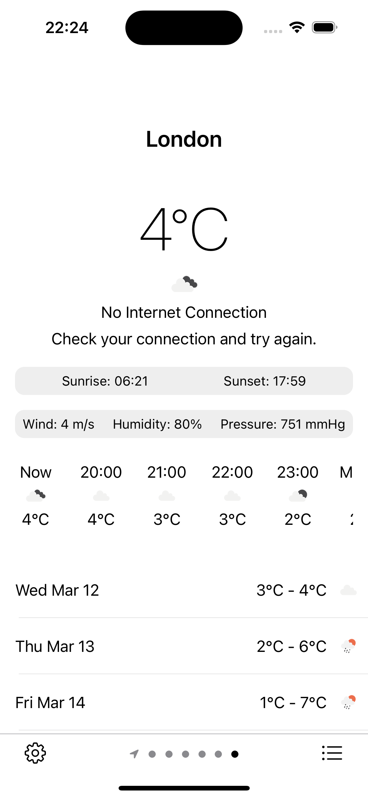</td>
  </tr>
  <tr>
    <td>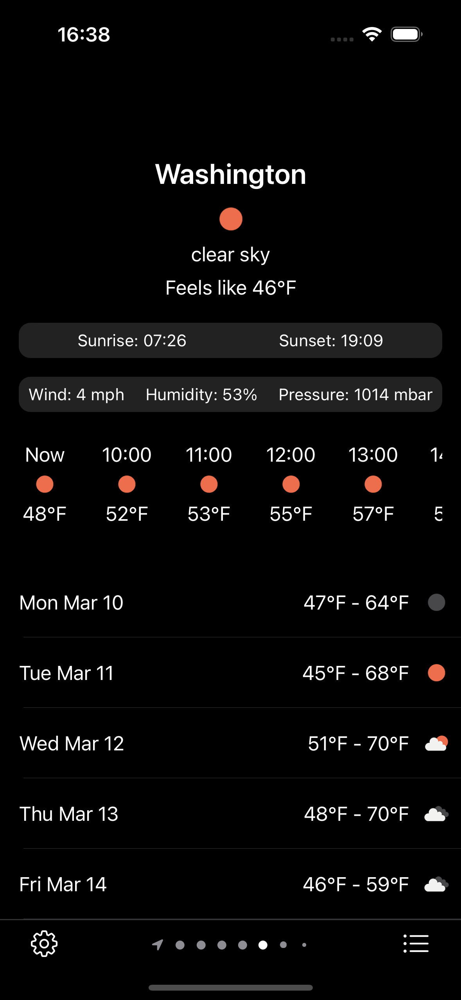</td>
    <td>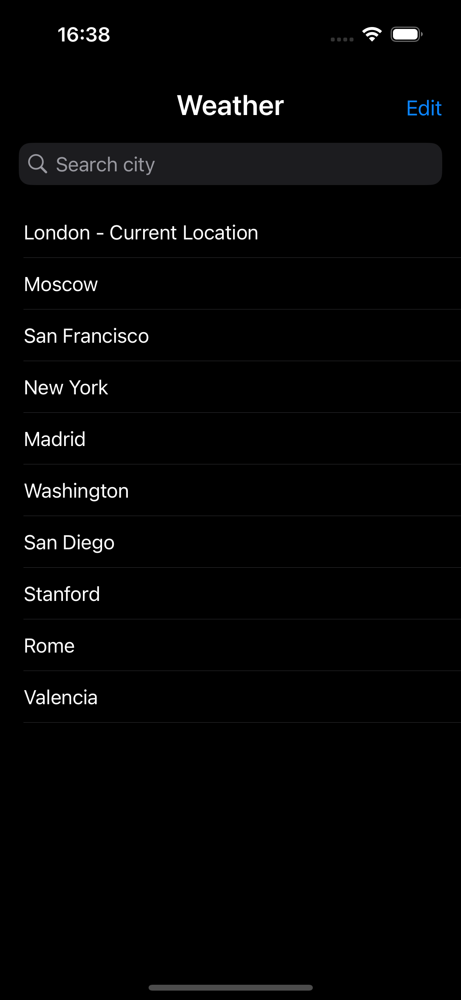</td>
    <td>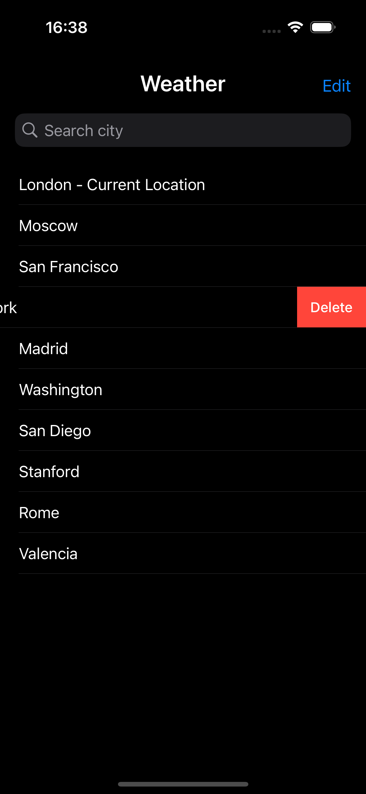</td>
  </tr>
    <tr>
    <td>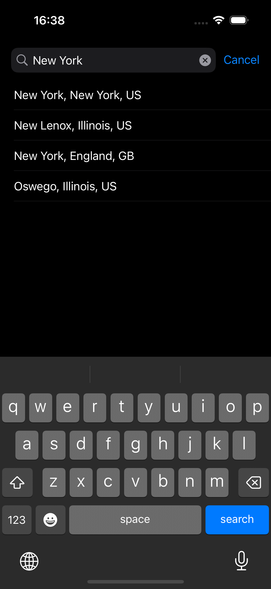</td>
    <td>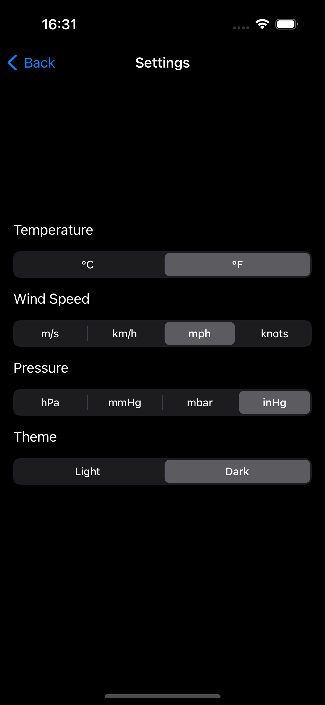</td>
    <td>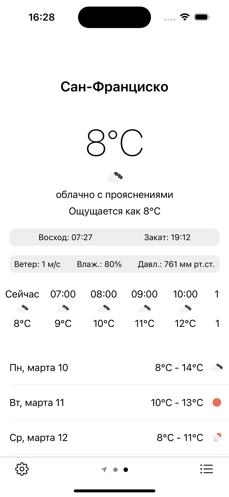</td>
  </tr>
    <tr>
    <td>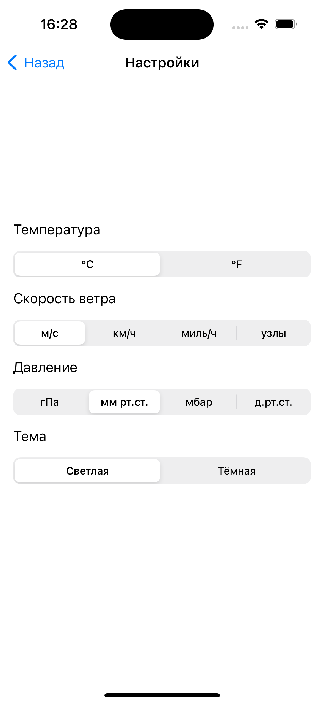</td>
    <td></td>
    <td></td>
  </tr>
</table>  

## Installation  

1. **Clone the repository** to your local machine.  

2. **Create a configuration file for API keys:**  
   - In the project folder, create a file named `Config.xcconfig`:  
     - **WeatherWatch1:** `/WeatherWatch/WeatherWatch1/WeatherWatch1/Config.xcconfig`  
     - **WeatherWatch2:** `/WeatherWatch/WeatherWatch2/WeatherWatch2/Config.xcconfig`
     - **WeatherWatch3:** `/WeatherWatch/WeatherWatch3/WeatherWatch3/Config.xcconfig`
     - **WeatherWatch4:** `/WeatherWatch/WeatherWatch4/WeatherWatch4/Config.xcconfig`  
   - Add the following line:  
     ```
     OPENWEATHER_API_KEY=your_api_key
     ```
   - Replace `your_api_key` with your actual API key from [OpenWeather API](https://api.openweathermap.org/).  

3. **Open the project in Xcode (Version 15.2 or newer) and run the app.**  


